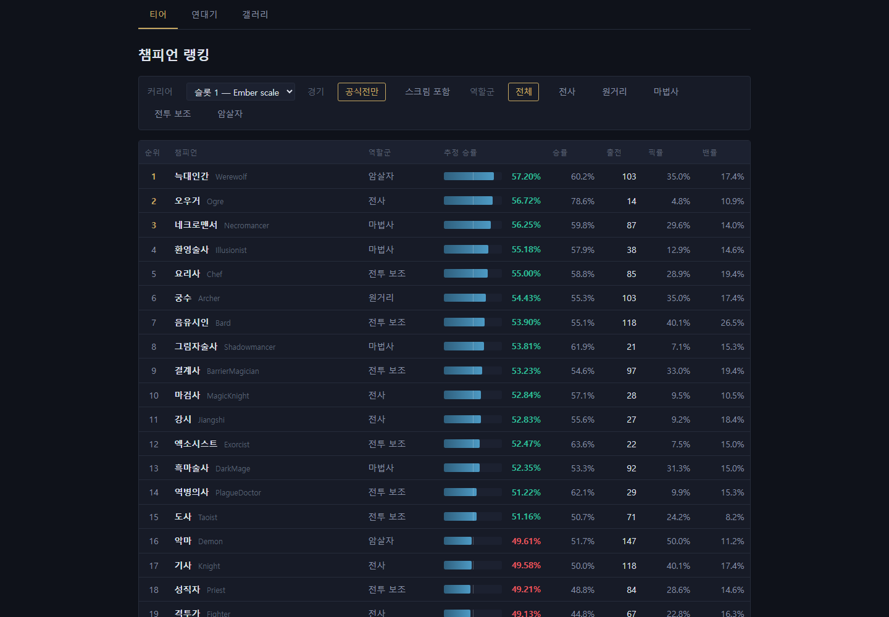
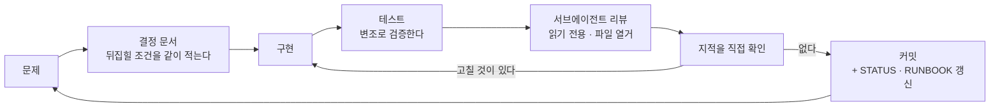
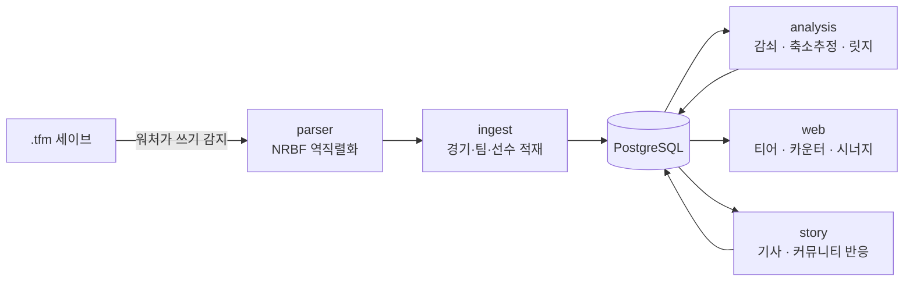
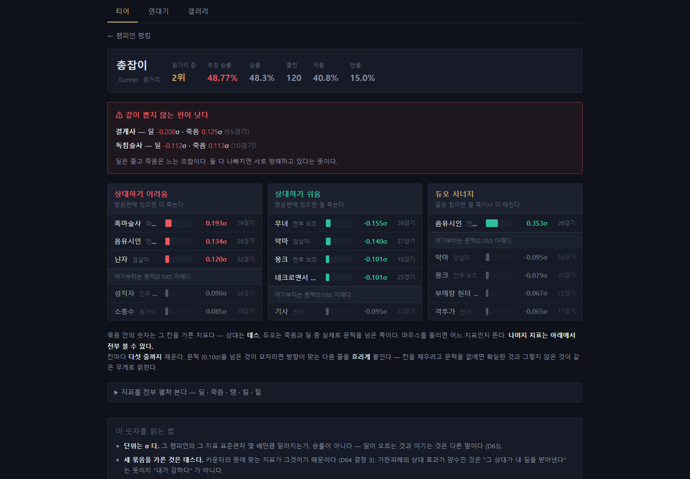
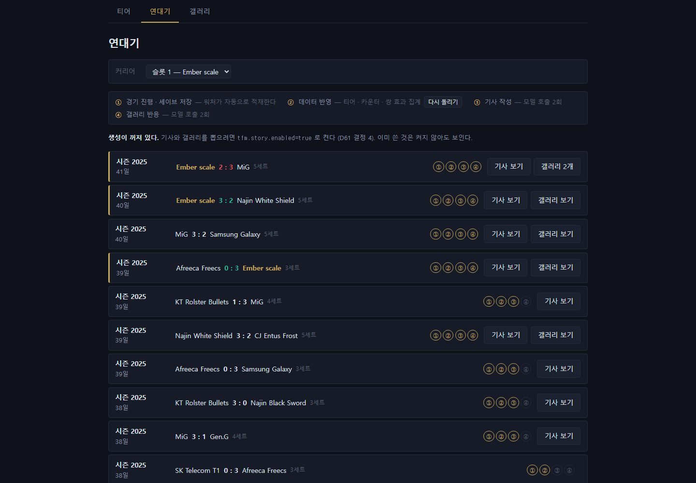
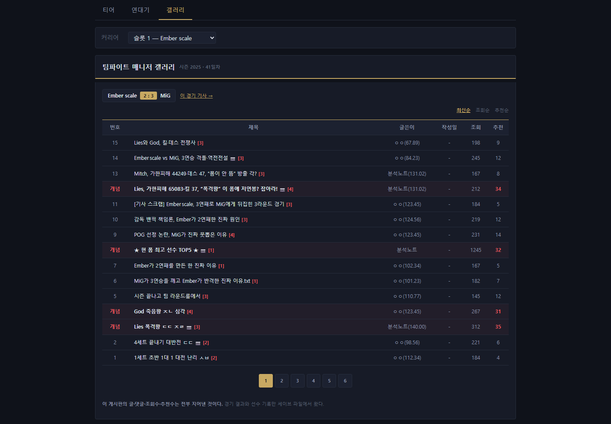

# 팀파이트 매니저 티어 분석

> 게임이 시즌마다 버리는 경기 기록을 누적해서 **챔피언 티어 · 카운터 · 조합 시너지**를 뽑는다.
> 세이브 파일(`.tfm`)을 직접 파싱한다 — OCR도, 게임 모드도 쓰지 않는다.



`Spring Boot 4.1.1` · `Java 21` · `PostgreSQL 16 + Flyway` · `Thymeleaf`
자바 **163파일 / 약 17,000줄** · 테스트 **539개** · 설계 결정 **83건**

수치는 전부 실제 세이브 3개(공식 800 + 스크림 407 = **1,207경기**, 챔피언 40종)에서 측정했다.

---

## 개발 워크플로우

바이브 코딩.
**무엇을 왜 그렇게 정했는지, 그리고 에이전트에게 무엇을 넘기고 무엇을 안 넘기는지**



### 1. 결정이 먼저다 — `decisions/` 82개

파일 하나에 결정 하나. 파일명이 제목.

**모든 결정에 「근거」을 같이 적는다.** 근거가 사라지면 결정도 다시 봐야 하기 때문이다.
그리고 **원본은 절대 고치지 않는다** — 생각이 바뀌면 새 번호를 발급하고 "D52를 고친다"로 잇는다.
그래야 *무엇을 틀렸었는지*가 남는다. 덮어쓰면 그 정보가 사라진다.

```
decisions/D52_패치-가중치는-지금-정할-수.md      ← 원래 결론
decisions/D78_쌍-효과에도-패치-감쇠를-건다-D52-를-고친다.md   ← 뒤집은 근거와 실측값
```

[`decisions/README.md`](decisions/README.md) 상단의 **주제별 라우팅 표**가 82개 중 무엇을 읽을지 정한다.
표가 지정한 만큼만 읽는다 — 표에 없는 파일을 3개 넘게 뒤지고 있다면 그건 표가 틀린 것이고, 표를 고친다.

### 2. 문서 크기 예산

낡은 문서는 없느니만 못하다. 그래서 세션 시작에 읽는 두 문서에 **한도**가 걸려있다.

| 문서 | 답하는 질문 | 한도 |
|---|---|---|
| [`STATUS.md`](STATUS.md) | 지금 무엇이 돌고, 무엇이 막혀 있나 | 3KB |
| [`RUNBOOK.md`](RUNBOOK.md) | 이걸 어떻게 돌리나 | 3KB |

넘치면 내용을 `decisions/` 로 내려보낸다. 둘을 합친 6KB가 **세션 시작의 고정 컨텍스트**이다.
그리고 **커밋할 때 같이 고친다** — 이게 지켜지지 않으면 위 한도는 의미가 없다.

### 3. 에이전트에게 넘기는 것 / 안 넘기는 것

| | |
|---|---|
| **안 넘기는 것** | 설계 판단 · 구현 · 문서 갱신 · 커밋 · 최종 결정 |
| **넘기는 것** | 파일을 많이 읽어야 하지만 **판단은 필요 없는** 일 (리뷰 · 스키마 점검 · 삼켜진 오류 찾기 · 죽은 코드) |

이 프로젝트의 어려운 부분(카운터 · 시너지 · 2단 축소추정)은 결정들이 서로 얽혀 있어
**한 사람 머릿속에 있어야 한다.** 나눌 수 있는 부분은 애초에 어렵지 않다.

프롬프트에는 항상 **읽을 파일을 경로로 열거**한다. "저장소를 훑어라"는 컨텍스트를 태운다.
결정을 82개로 쪼갠 덕분에 이 원칙을 실제로 지킬 수 있게 됐다.

> 첫 배분에서 세 에이전트가 각자 다른 파일을 봤는데 **결함의 성격이 같았다** —
> 전부 "표본에 없어서 골든 파일이 못 잡는 것"이었다. 서로 다른 각도에서 같은 구멍을 짚은 것이
> 이 방식의 값어치였다. 자세한 것은 [`workflow.md`](workflow.md).

### 4. 테스트는 변조로 검증

> **이 단언이 검증 대상 말고 다른 경로로도 만족되는가?**

그래서 **막으려는 버그를 실제로 코드에 넣고, 실패하는지 본다.** 

실제로 다섯 번 걸렀다. 워처 테스트 셋은 원인이 전부 같았다 — 재훑기 테스트가 워처를 켠 채로
파일을 만들어 정상 이벤트만으로 통과했고, 정지 테스트는 취소할 타이머가 없었고,
생성 테스트는 `Files.writeString`(CREATE+MODIFY)을 써서 CREATE 구독을 지워도 통과했다.

그리고 **단위 테스트는 그 크기에서 드러나는 것만 지킨다.** Bradley-Terry 적합이 챔피언 2~5종
테스트 16개를 전부 통과한 채로 실제 데이터(40종 · 관측 19,200개)에서 수렴하지 않아 집계가
통째로 죽었다. 반복법이 걸린 코드에는 **운영 규모 입력을 한 번 돌리는 테스트**를 같이 둔다.

### 5. 낡은 문서를 이기는 장치

문서가 많아지면 **서로 어긋난 채로 둘 다 살아남는다.** 그게 제일 위험하다.
그래서 `decisions/README.md` 상단에 「최근에 뒤집힌 것」 목록을 둔다.

> 아래 항목과 어긋나는 서술을 옛 문서에서 보면 **아래가 맞다.**

읽는 사람(그리고 에이전트)이 어느 쪽을 믿을지 한 곳에서 정해 준다.

---

## 무엇이 만들어지나



| 화면 | |
|---|---|
| **티어** `/tier` | 추정 승률 순위. 역할군 탭 · 스크림 포함 여부 |
| **챔피언** `/champion/{code}` | 상대하기 어려움 · 쉬움 · 듀오 시너지 세 묶음 |
| **연대기** `/story` | 매치 하나가 한 줄. 적재 → 집계 → 기사 → 반응 진행 상태 |
| **갤러리** `/gallery` | 경기마다 생기는 커뮤니티 반응 게시판 |

<table>
<tr>
<td width="33%"><br><sub>챔피언 — 세 묶음</sub></td>
<td width="33%"><br><sub>연대기 — 매치 한 줄</sub></td>
<td width="33%"><br><sub>갤러리 — 커뮤니티 반응</sub></td>
</tr>
</table>

**숫자를 어떻게 만드나** — 승패가 아니라 **경기력**에서 본다. 805경기로도 승패는 모자란다.
패치가 지날수록 옛 경기의 무게를 지수로 깎고(감쇠), 표본이 얇으면 전체 평균 쪽으로 당긴다(2단 축소추정).
챔피언 쌍의 효과는 릿지 회귀로 뽑되 팀 강도를 같이 통제한다.
근거와 실측값은 `decisions/` D9 · D14 · D15 · D50 · D63~D65 · D76 · D78.

---

## 빠른 시작

PostgreSQL 16과 JDK 21이 필요하다. Windows 기준이다.

```powershell
# 1. DB 생성 (스키마는 Flyway가 만든다)
createdb -U postgres tfm

# 2. 세이브 폴더와 비밀번호를 알려준다
copy .env.example .env    # 편집

# 3. 실행 — 컴파일부터 브라우저 열기까지
.\run.ps1
```

`run.ps1` 은 뜨기 전에 **무엇을 쓰는지 먼저 찍는다** — DB 비밀번호의 출처, API 키가 어디서 오는지,
아예 없으면 그 사실까지. 옵션은 [`RUNBOOK.md`](RUNBOOK.md).

기사·갤러리 생성은 OpenAI 호환 엔드포인트를 쓴다(기본 Groq). **키가 없으면 그 기능만 꺼지고
적재·집계·통계 화면은 그대로 돈다.**

---

## 문서 지도

| 문서 | |
|---|---|
| [`decisions/`](decisions/) | **설계 결정 82건.** 근거 · 실측값 · 뒤집힐 조건 |
| [`workflow.md`](workflow.md) | 에이전트 배분과 프롬프트 규칙. 실패 기록 포함 |
| [`architecture.md`](architecture.md) | 시스템 경계와 의존 방향 |
| [`structure.md`](structure.md) | 파일·패키지가 어디에 왜 있나 |
| [`savefile.md`](savefile.md) | 세이브 파일 구조 (리버싱 결과) |
| [`project.md`](project.md) | 요구사항 · 범위 · 완료 기준 |
| [`TUNING.md`](TUNING.md) | 손으로 고치는 값 (감쇠 반감기 · 출력 문턱 · 프롬프트) |
| [`banpick.md`](banpick.md) | 밴픽 시뮬레이터 설계 — 다음 구현 |
| [`STATUS.md`](STATUS.md) · [`RUNBOOK.md`](RUNBOOK.md) | 지금 상태 · 실행 명령 |
| [`CLAUDE.md`](CLAUDE.md) | 에이전트가 세션 시작에 읽는 규칙 |

---

## 한계

- **로컬 단일 사용자 전제다.** 인증이 없고 루프백에만 바인딩한다. 그 전제를 실제로 참으로
  만드는 한 줄이 `server.address` 다 — 네트워크에 열면 누구나 볼 수 있다
- **커리어(세이브 슬롯)를 가로질러 합치지 않는다.** 패치가 커리어마다 고유 생성되므로
  같은 이름의 챔피언이라도 커리어별로 스탯이 반대 방향으로 가 있다
- **등급(S·A·B)을 안 매긴다.** 기저 승률의 흩어짐(3.3%p)이 표본 오차(±3.4%p)와 비슷해서
  지금 컷을 그으면 잡음에 등급을 매기는 것이 된다. 대신 순위를 쓴다
- **시너지는 2인까지만 실재한다.** 3인 조합은 표본이 아직 없다
- 아직 안 정한 것들은 [`decisions/OPEN.md`](decisions/OPEN.md) 에 모아 둔다

## 고지

- 이 저장소는 **세이브 파일 포맷을 리버싱한 결과**를 포함한다. 게임을 수정하지 않고
  **읽기만** 한다 (`tfm.read-only`)
- 게임사(Samoyed)의 저작물은 포함하지 않는다. 챔피언 코드명은 분석에 필요한 식별자로만 쓴다
- 팀파이트 매니저는 Samoyed의 상표다. 이 프로젝트는 비공식 개인 도구다

## 라이선스

[MIT](LICENSE)
